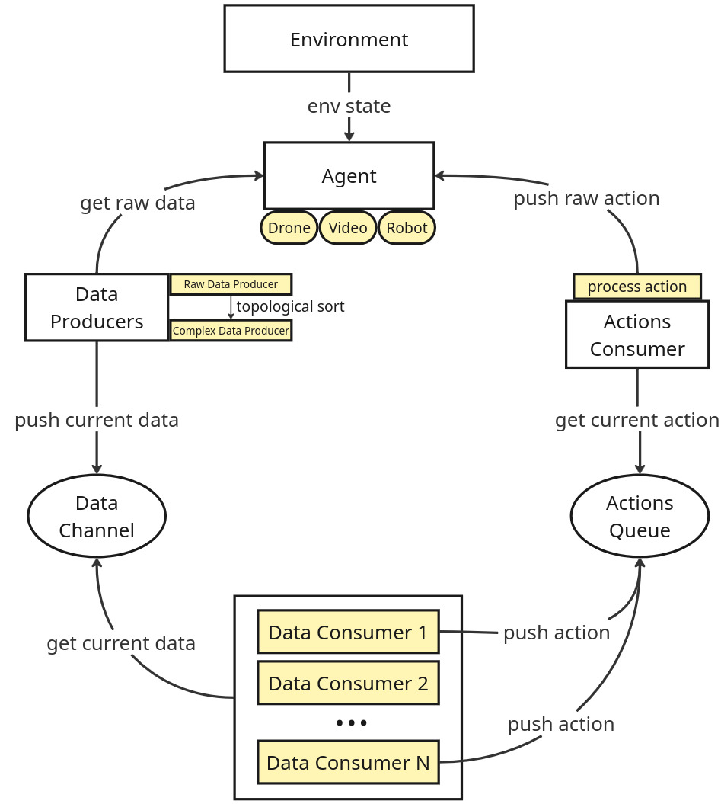

# Drone Controller

Install `requirements-base.txt` for the common requirements without any 3rd party dependencies, lile `olympe` (from parrot).
See [examples](examples/) for how to run it.

## Architecture:



The two 'core' components of any robotics application are: the *data channel* and the *actions queue*. The data consumers interact with the drone (or any robot) to get raw data and write them to the data channel, while the data consumers interact with the channel and always have access to the latest data. Some data consumers are also action products and write to the actions queue. Then, the actions consumer reads one action at a time from the actions queue and sends raw actions to the drone.

The usual flow is like this:
```

 Drone  -- raw data --> Data Producer List --> Data Channel       Actions Queue  <-- Action2Env -- raw action --> Drone
(robot)                                       (rgb, pose...)     (LIFT, MOVE...)     (action_fn)                 (robot)
               |                ↑                  |                    ↑
               |-------> pose                      |-> [Controller 1] --|
                         rgb -> semantic           |-- [Controller 2] --|
                             -> depth              |       ...          |
                                  -> normals       |-- [Controller n] --|
```

## Example

For an example you can run, see [this](examples/hello-world/main.py).

### Using the `Robot` high-level wrapper

Every `main` script will contain the following logic:

```python
def main():
    """main fn"""
    drone = XXXDrone(ip := drone_ip) # XXX = specific real or simulated drone like Olympe
    drone.connect() # establish connection to the drone before any callbacks
    actions_queue = ActionsQueue(actions=["a1", "a2", ...]) # defines the generic actions
    data_channel = DataChannel(supported_types=["rgb", "pose", ...], eq_fn=lambda a, b: a["rgb"] == b["rgb"]) # defines the data types and how to compare equality (i.e. drone produced same frame twice)

    # action->drone converts a generic action to an actual drone action
    def XXXaction_fn(drone: XXXDrone, action: Action) -> bool:
        return drone.make_raw_action(action) # convert generic "a1", "a2" to raw drone-specific action

    robot = Robot(env=drone, data_channel=data_channel, actions_queue=actions_queue, action_fn=XXXaction_fn)
    # define the data producers. The 'raw' one is added by default (env to raw data)
    robot.add_data_producer(SemanticdataProducer(ckpt_path=path_to_model, ...))

    key_to_action = {"space": "a1", "w": "a2"} # define the mapping between a key release and an action pushed in the queue
    screen_displayer = ScreenDisplayer(data_channel, actions_queue, key_to_action) # data consumer + actions producer (keyboard)
    robot.add_controller(screen_displayer, name="Screen displayer")
    robot.run()

    drone.disconnect() # disconnect from the drone.
    data_channel.close() # close the data channel as well which also waits for logs (if enabled) to be written to disk.

if __name__ == "__main__":
    main()
```

### Using the low-level primitives defined by the library

The `Robot` class above is just a nice wrapper on top of the low-level machinery. We could replace it completely for more control (i.e. >1 data channels if we want) like this:

```python
def main():
    """main fn"""
    drone = XXXDrone(ip := drone_ip) # XXX = specific real or simulated drone like Olympe
    drone.connect() # establish connection to the drone before any callbacks
    actions_queue = ActionsQueue(actions=["a1", "a2", ...], queue=Queue()) # defines the generic actions and the queue type
    data_channel = DataChannel(supported_types=["rgb", "pose", ...], eq_fn=lambda a, b: a["rgb"] == b["rgb"]) # defines the data types and how to compare equality (i.e. drone produced same frame twice)

    # define the data producers.
    raw_data = RawDataProducer(drone) # populates the data channel with RGB & pose from drone (raw data)
    semantic_data_producer = SemanticdataProducer(ckpt_path=path_to_model, ...)
    data_producers = DataProducers2Channels([drone2data, semantic_data_producer, ...], [channel, ...]) # data structure for all data
    # define the controllers (only screen displayer + keyboard controls here)
    key_to_action = {"space": "a1", "w": "a2"} # define the mapping between a key release and an action pushed in the queue
    screen_displayer = ScreenDisplayer(data_channel, actions_queue, key_to_action) # data consumer + actions producer (keyboard)
    # action->drone converts a generic action to an actual drone action
    def XXXaction_fn(drone: XXXDrone, action: Action) -> bool:
        return drone.make_raw_action(action) # convert generic "a1", "a2" to raw drone-specific action
    action2drone = Actions2Environment(drone, actions_queue, action_fn=XXXaction_fn)

    threads = ThreadGroup({ # simple dict[str, Thread] wrapper to manage all of them at once.
        "Drone -> Data": data_producers,
        "Screen displayer (+keyboard)": screen_displayer,
        "Action -> Drone": action2drone,
    }).start()

    while not threads.is_any_dead(): # wait for any of them to die or drone to disconnect
        time.sleep(1) # important to not throttle everything with this main thread

    drone.disconnect() # disconnect from the drone.
    threads.join(timeout=1) # stop all the threads
    data_channel.close() # close the data channel as well which also waits for logs (if enabled) to be written to disk.

if __name__ == "__main__":
    main()
```
